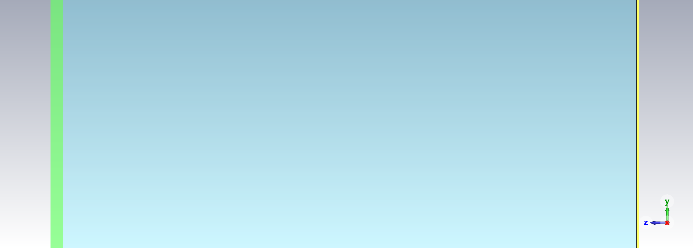
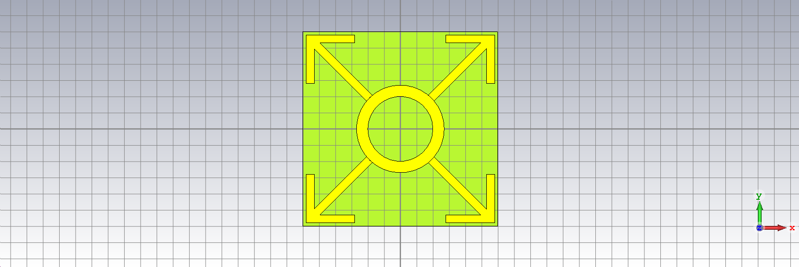



_this post is a work in progress_

In the fall semester of academic year 2024-2025 I decided took upon a project in order to
design a microwave absorber based on metamaterials. In this post I document the
progress as per the development of the cell and the modeling in order to lay everything
publicly available and understand better as I try explaining the process
to this figurative rubber :duck: that _is_ my editor. Finally I have opened a 
GitHub repository for the report that will eventually be submitted to my university and 
based upon I'll be _eventually_ credited; it can be found [here](https://github.com/markdlp/ParametricStudy_MicrowaveAbsorberBasedOnMetamaterials).

### Abstract
Microwave absorbers play a crucial role in modern
telecommunications and electronic systems by mitigating unwanted electromagnetic
interference (EMI) and enhancing the performance of various devices. These absorbers are
essential in applications ranging from radar systems and anechoic chambers to consumer
electronics and medical devices. Traditional microwave absorbers, while effective, often
suffer from limitations such as bulkiness and narrow bandwidth. Metamaterial-based
microwave absorbers offer a promising alternative due to their unique electromagnetic
properties, which are not found in natural materials. These engineered materials can
achieve near-unity absorption across a wide range of frequencies, making them highly
efficient. The advantages of metamaterial absorbers include their thin profile,
lightweight nature, and the ability to tailor their absorption characteristics through
precise structural design. This makes them ideal for applications requiring compact and
efficient EMI mitigation. Additionally, metamaterial absorbers can be designed to operate
over multiple frequency bands, providing versatility and enhanced performance in complex
electromagnetic environments.

### Introduction
Metamaterials are artificially designed materials that
exhibit peculiar properties like negative refractive index, 
Snell's law reversal, Doppler effect reverse, and left-handed behavior. 
These properties make them suitable for various applications, including perfect absorption. 
Metamaterial absorbers can achieve near-unity absorption, thin profiles, lightweight 
characteristics, and design flexibility.

The development of metamaterial absorbers has seen significant progress, with
researchers exploring various designs and materials to enhance their performance.
Metamaterial absorbers are predominantly used in the microwave, terahertz, and optical
frequency spectra. Recent advancements include the development of multi-band
polarization-insensitive metamaterial absorbers for microwave applications, broadband
microwave coding metamaterial absorbers, and ultra-wideband
origami microwave absorbers.

This study begins with a theoretical exploration of absorber devices and the unique
properties of metamaterials that make them suitable for electromagnetic wave absorption.
Following this, the report details the implementation of a specific microwave absorber
device using advanced simulation software, highlighting the practical aspects of device
design and performance evaluation. Finally, the report addresses the parametric design and
optimization of the device, fine-tuning structural parameters to achieve optimal absorption
characteristics. Through this comprehensive approach, the report aims to provide a thorough
understanding of the principles, design methodologies, and practical applications of
metamaterial-based microwave absorbers.

### Theoretical Study
Metamaterials are artificially engineered materials
with unique electromagnetic properties not found in nature. They are designed with
specific geometrical structures that allow them to exhibit properties like negative
refractive index, reverse Snell's law, and right/left-handed behavior. The first to
coin the term of metamaterial absorbers was Victor Veselago.

An MMA typically comprises three layers: 

- A periodic metallic pattern on top
- A dielectric substrate in the middle
- A bottom metallic ground plane

As multi-layer structures in MMAs enable broadband absorption by creating multiple
resonant frequencies. By stacking different layers with varying properties, a wider
range of frequencies can be absorbed effectively.

Impedance matching is crucial for MMAs to minimize reflection and maximize absorption.
This is achieved when the impedance of the MMA is matched to the impedance of free
space, ensuring that incident electromagnetic waves are absorbed rather than
reflected.

In order to evaluate the absorption of the microwave metamaterial absorber proposed in
this study the reflection and transmission power shall be calculated as well as the 
reflection coefficient. The bare necessary equations are shown in.

$$
Z = Z_0 \sqrt{\frac{\mu_r}{\epsilon_r}} \newline \newline
\Gamma = \frac{Z - Z_0}{Z + Z_0} 
T = \frac{2Z_0}{Z + Z_0} 
A = 1 - |\Gamma|^2 - |T|^2 
$$

*The metal resonance layer is technically an extra layer on top of the substrate and as a
matter of fact it's the only layer above Z=0 for reasons that'll become obvious later on.

At first placing the substrate without the resonance layer, then I'll place the two other
layers, turn on the orthographic side view to remove shadows and voila: 

I think it really gives a sense of scale as the air layer truly dwarfs the others.

Now its time to add the ring that is of the same material and thickness as the backplate and lies
on top of the dielectric substrate. 

For the arrows I make the assumption that both the arrow body and point are
\\(\alpha = 0.5mm\\) of width. 
In order to accurately place all the curve points that define the arrow some basic calculations
shall be made. The two points of the arrow base lay exactly on the arc of the ring (w/ r=2.7mm)
and are equidistant from curve y=x so the in order to find their cartesian coordinates the following
system shall be solved.

```matlab
syms x1 x2

eq1 = 2*(x1 - x2)^2 == .5^2;
eq2 = sqrt(x2^2 + x1^2) == 2.7;

sol = solve([eq1, eq2], [x1 x2]);
disp([sol.x1 sol.x2]);
```

$$
    \displaystyle \begin{array}{l} \left(\begin{array}{cc} \sigma_3 -\frac{2916\,\sigma_1 }{1433} & -\sigma_1 \newline \sigma_4 -\frac{2916\,\sigma_2 }{1433} & -\sigma_2 \newline \frac{2916\,\sigma_1 }{1433}-\sigma_3  & \sigma_1 \newline \frac{2916\,\sigma_2 }{1433}-\sigma_4  & \sigma_2  \end{array}\right)\newline\newline \textrm{where}\newline \sigma_1 =\sqrt{\frac{729}{200}-\frac{7\,\sqrt{59}}{80}}\newline \sigma_2 =\sqrt{\frac{7\,\sqrt{59}}{80}+\frac{729}{200}}\newline \sigma_3 =\frac{400\,{{\left(\frac{729}{200}-\frac{7\,\sqrt{59}}{80}\right)}}^{3/2} }{1433}\newline \sigma_4 =\frac{400\,{{\left(\frac{7\,\sqrt{59}}{80}+\frac{729}{200}\right)}}^{3/2} }{1433}\end{array}
$$

Which results in two points per quadrant, picking out the two points of the 1st quadrant and
inserting them to CST the arrow body is parallel again 

Then the arrow is mirrored against the X, the Y and the XY planes in order to reach all four
sides of the cell, then the face is covered with copper and a height of d=0.035mm is also
attributed, which is why it was important to place all other layers below Z=0.

|
:-------------------------:|:-------------------------:
|  |  |

Now I'll try and perform a simulation using the frequency solver in CST from 2.7 to 12.7 GHz,
adding a port with space (\\(Z_{max}\\)) in front of the cell and setting the orientation to 
negative so that is faces the absorber and the coordinates as full-plane the boundaries 
will be periodic along the XY plate and I will add an absorbing condition (\\(Z_{min}\\)).

The mesh of after of the structure after the simulation is as: 

For the Electrical Field Simulation > and for the frequency [2.7, 7.7, 12.7] GHz and for \\(Z_{max}(1)\\) is as:
||
:-------------------------:|:-------------------------:|:-------------------------:
||||


For the Electric Field Simulation > and for the frequency [2.7, 7.7, 12.7] GHz and for \\(Z_{max}(2)\\) is as:
||
:-------------------------:|:-------------------------:|:-------------------------:
||||

Taking a look in the \\(S_{11}\\) of \\(Z_{max}\\) that represents the reflection
coefficient as well as the \\(S_{21}\\) that represents the port coupling, after the
simulation as... The Absorptivity (against the frequency)
is an essential metric and CST calculates it as shown in ....
For the evaluation of the absorber Absorptivity can be calculated using the
Fresnel equation: \\( A = 1 - R - T \\), where T is the transmission coefficient 
... and can be calculated using the Fresnel equation: \\(T = \frac{2Z_0}
{Z+Z_0}\\) and R is the reflection coefficient (\\(\Gamma\\)) and can be calculated 
from the formula: \\(R = \frac{Z - Z_0}{Z + Z_0}\\). However the Z mentioned needs
to be the normalized impedance of the absorber so this is where the calculation 
will start.