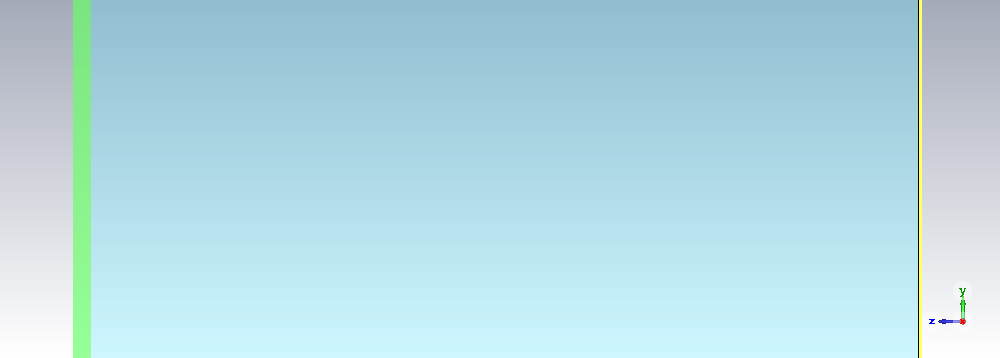
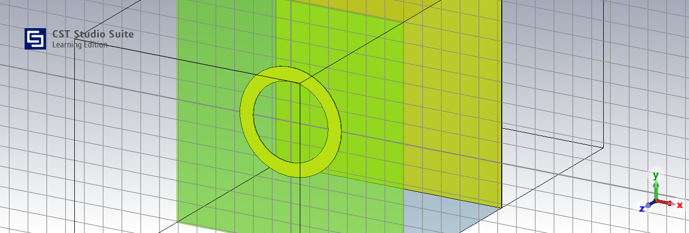
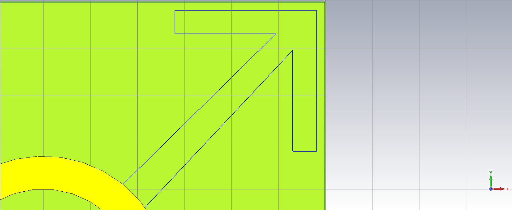
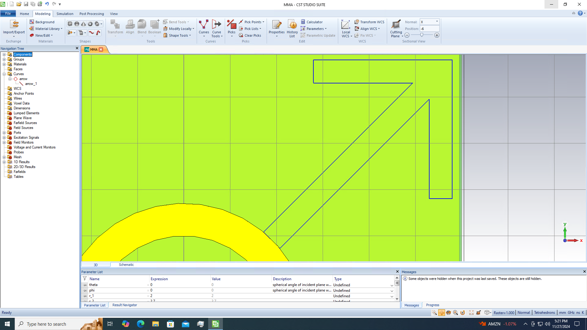
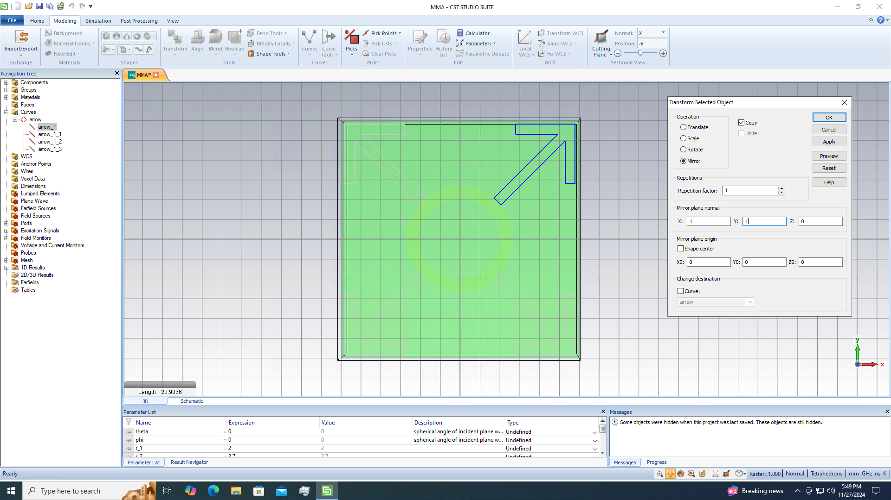
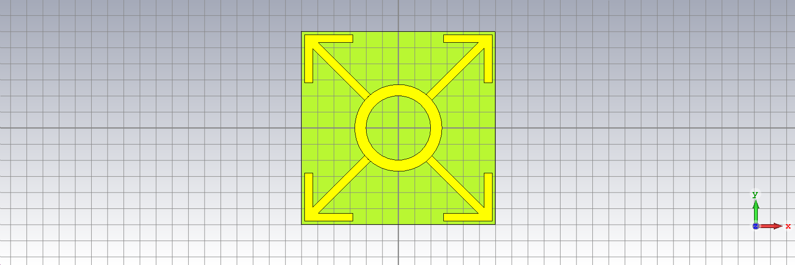
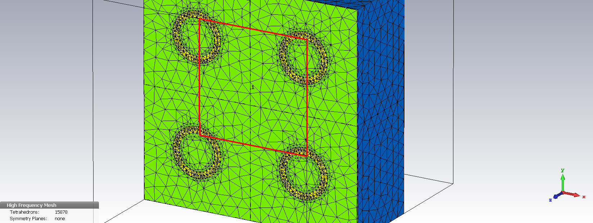
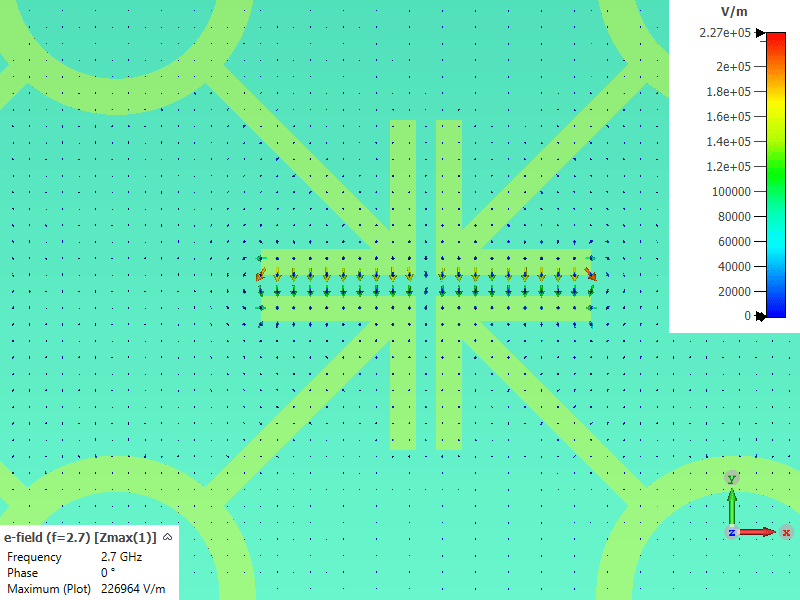



### Parametric Study of a Microwave Absorber Based on Metamaterials

#### _this post is a work in progress_

In the fall semester of academic year 2024-2025 I decided took upon a project in order to
design a microwave absorber based on metamaterials. In this post I document the
progress as per the development of the cell and the modeling in order to lay everything
publicly available and understand better as I try explaining the process
to this figurative rubber ducky :duck: that _is_ my editor. Finally I have opened a 
GitHub repository for the report that will eventually be submitted to my university and 
based upon I'll be _eventually_ credited; it can be found [here](https://github.com/markdlp/ParametricStudy_MicrowaveAbsorberBasedOnMetamaterials).

So to start by designing a basic layout in CST I'll implement a three-layer structure:
- A dielectric Substrate w/ a metal Resonance Layer*
- An Air Layer
- A Metal Copper Back-Plate

*The metal resonance layer is technically an extra layer on top of the substrate and as a
matter of fact it's the only layer above Z=0 for reasons that'll become obvious later on.

At first placing the substrate without the resonance layer, then I'll place the two other
layers, turn on the orthographic side view to remove shadows and voila: 

I think it really gives a sense of scale as the air layer truly dwarfs the others.

Now its time to add the ring that is of the same material and thickness as the backplate and lies
on top of the dielectric substrate. 

For the arrows I make the assumption that both the arrow body and point are
\\(\alpha = 0.5mm\\) of width. 
In order to accurately place all the curve points that define the arrow some basic calculations
shall be made. The two points of the arrow base lay exactly on the arc of the ring (w/ r=2.7mm)
and are equidistant from curve y=x so the in order to find their cartesian coordinates the following
system shall be solved.

```matlab
syms x1 x2

eq1 = 2*(x1 - x2)^2 == .5^2;
eq2 = sqrt(x2^2 + x1^2) == 2.7;

sol = solve([eq1, eq2], [x1 x2]);
disp([sol.x1 sol.x2]);
```

$$
    \displaystyle \begin{array}{l} \left(\begin{array}{cc} \sigma_3 -\frac{2916\,\sigma_1 }{1433} & -\sigma_1 \newline \sigma_4 -\frac{2916\,\sigma_2 }{1433} & -\sigma_2 \newline \frac{2916\,\sigma_1 }{1433}-\sigma_3  & \sigma_1 \newline \frac{2916\,\sigma_2 }{1433}-\sigma_4  & \sigma_2  \end{array}\right)\newline\newline \textrm{where}\newline \sigma_1 =\sqrt{\frac{729}{200}-\frac{7\,\sqrt{59}}{80}}\newline \sigma_2 =\sqrt{\frac{7\,\sqrt{59}}{80}+\frac{729}{200}}\newline \sigma_3 =\frac{400\,{{\left(\frac{729}{200}-\frac{7\,\sqrt{59}}{80}\right)}}^{3/2} }{1433}\newline \sigma_4 =\frac{400\,{{\left(\frac{7\,\sqrt{59}}{80}+\frac{729}{200}\right)}}^{3/2} }{1433}\end{array}
$$

Which results in two points per quadrant, picking out the two points of the 1st quadrant and
inserting them to CST the arrow body is parallel again 

Then the arrow is mirrored against the X, the Y and the XY planes in order to reach all four
sides of the cell, then the face is covered with copper and a height of d=0.035mm is also
attributed, which is why it was important to move all other layers below Z=0. 


Now I'll try and perform a simulation using the frequency solver in CST from 2.7 to 12.7 GHz,
adding a port with space (\\(Z_{max}\\)) in front of the cell and setting the orientation to 
negative so that is faces the absorber and the coordinates as full-plane the boundaries 
will be periodic along the XY plate and I will add an absorbing condition (\\(Z_{min}\\)).

The mesh of after of the structure after the simulation is as: 

For the Electrical Field Simulation > and for the frequency 2.7GHz and for \\(Z_{max}(1)\\) is as:
